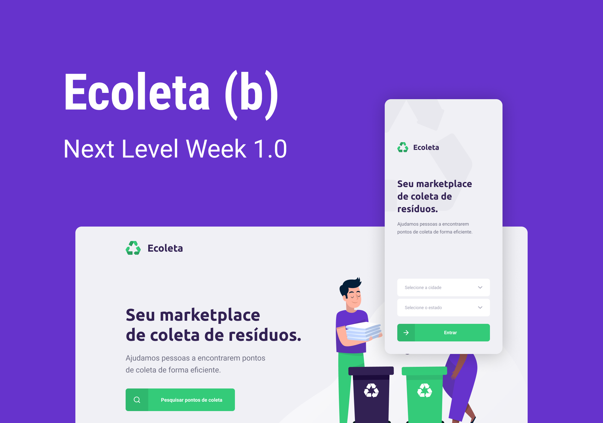

<h1 align="center">
	
</h1>

<h3 align="center">
  Seu marketplace de coleta de resíduos.
</h3>

<p align="center">
  

  

  <a href="https://www.linkedin.com/in/larabeatrizms/">
    
  </a>
  
  
  
  <a href="https://github.com/larabeatrizms/ecoleta/commits/master">
    
  </a>
  
  <a href="https://github.com/larabeatrizms/ecoleta/issues">
    
  </a>
</p>

<p align="center">
  <a href="#-sobre-o-projeto">Sobre o projeto</a>&nbsp;&nbsp;&nbsp;|&nbsp;&nbsp;&nbsp;
  <a href="#-tecnologias">Tecnologias</a>&nbsp;&nbsp;&nbsp;|&nbsp;&nbsp;&nbsp;
  <a href="#-Iniciando">Iniciando</a>&nbsp;&nbsp;&nbsp;|&nbsp;&nbsp;&nbsp;
  <a href="#-como-contribuir">Como contribuir</a>&nbsp;&nbsp;&nbsp;|&nbsp;&nbsp;&nbsp;
  <a href="#-autor">Autor</a>&nbsp;&nbsp;&nbsp;|&nbsp;&nbsp;&nbsp;
</p>

<p align="center">
  <a href="https://cool-tools.netlify.app/" rel="noopener">
    
  </a>
</p>

## 👨🏻‍💻 Sobre o projeto

Ecoleta é um projeto desenvolvido com base na semana internacional do meio ambiente. O objetivo é conectar pessoas a empresas que coletam resíduos específicos, como lâmpadas, baterias, óleo de cozinha etc.

Esta aplicação foi desenvolvida na Next Level Week da Rocketseat e adicionei algumas novas functionalidades.

O UI Design foi desenvolvido na Figma e foi usado para criar o aplicativo inteiro. Você pode acessar o projeto na Figma, neste [link](https://www.figma.com/file/1SxgOMojOB2zYT0Mdk28lB/Ecoleta?node-id=0%3A1).

### Funcionalidades

#### Backend - Rotas da Aplicação

- **`POST /points`**: Rota para cadastrar um novo ponto de coleta. O corpo da requisição deve conter as informações do ponto de coleta a ser cadastrada, sem o ID (gerado automaticamente pelo servidor).

- **`GET /points/:id`**: Rota para listar ponto de coleta específico.

- **`GET /points?city={city}&uf={uf}&items={item}`**: Rota para listar pontos de coleta utilizando uma busca por cidade, estado e itens de coleta, ou seja, filtrando os pontos de coleta de acordo com as propriedades recebidas..

- **`GET /items`**: Rota para listar os items de coleta.

#### Frontend - Requisitos funcionais e não funcionais

Serão duas telas no frontend.

- ✔ O usuário deve poder criar um ponto de coleta
- ✔ O usuário não deve criar um ponto de coleta sem algum campo preenchido.
- ✔ O usuário deve ser notificado caso algum campo esteja faltando para o cadastro do ponto de coleta.
- ✔ O usuário deve ser notificado(nova tela) que o cadastro foi concluído.

#### Mobile - Requisitos funcionais e não funcionais

- ✔ O usuário deve poder fornecer ao app seu estado e cidade.
- ✔ Com base nesse dados o app deve mostrar com base em sua geolocalização um mapa com pontos de coleta do estado e cidade.
- ✔ O usuário deve poder mandar mensagem no Whatsapp com base no número de celular do ponto de coleta cadastrado.
- ✔ O usuário deve poder mandar e-mail com base no e-mail do ponto de coleta cadastrado.

## 🚀 Tecnologias

Tecnologias que utilizei para desenvolver a aplicação:

- [Node.js](https://nodejs.org/en/)
- [ReactJS](https://reactjs.org/)
- [TypeScript](https://www.typescriptlang.org/)
- [React Native](https://reactnative.dev/)
- [Leaflet](https://leafletjs.com/)
- [Expo](https://expo.io/)
- [Express](https://expressjs.com/pt-br/)
- [SQLite](https://www.sqlite.org/)
- [React Router DOM](https://reacttraining.com/react-router/)
- [React Navigation](https://reactnavigation.org/)
- [React Icons](https://react-icons.netlify.com/#/)
- [Axios](https://github.com/axios/axios)
- [Eslint](https://eslint.org/)
- [Prettier](https://prettier.io/)
- [EditorConfig](https://editorconfig.org/)

## 💻 Iniciando

### Requisitos

- [Node.js](https://nodejs.org/en/)
- [Yarn](https://classic.yarnpkg.com/) or [npm](https://www.npmjs.com/)

**Clone o projeto e acesse a pasta**

```bash
$ git clone https://github.com/larabeatrizms/ecoleta.git && cd ecoleta
```

**Siga os passos abaixo**

### Backend

```bash
# Starting from the project root folder, go to backend folder
$ cd server

# Install the dependencies
$ yarn

# Make sure the keys in 'knexfile.js' to connect with your database
# are set up correctly.
# Once the services are running, run the seeds
$ yarn knex:seed

# Once the services are running, run the migrations
$ yarn knex:migrate

# To finish, run the api service
$ yarn dev

# Well done, project is started!
```

### Web

_Obs.: Antes de continuar, certifique-se que a API está executando_

```bash
# Starting from the project root folder, go to frontend folder
$ cd web

# Install the dependencies
$ yarn

# Be sure the file 'src/services/api.ts' have the IP to your API

# Start the client
$ yarn start
```

### Mobile

_Obs.: Antes de continuar, certifique-se que a API está executando_

```bash
# Starting from the project root folder, go to mobile folder
$ cd mobile

# Install the dependencies
$ yarn

# Be sure the file 'src/services/api.ts' have the IP to your API

# If you are going to emulate with android, run this command
# Be sure to have the emulator open
$ yarn android

# If you are going to emulate with ios, run this command
$ yarn ios
```

## 🤔 Como contribuir

**Crie um fork desse repositório**

```bash
# Fork using GitHub official command line
# If you don't have the GitHub CLI, use the web site to do that.

$ gh repo fork larabeatrizms/ecoleta
```

**Siga os passos abaixo**

```bash
# Clone your fork
$ git clone your-fork-url && cd ecoleta

# Create a branch with your feature
$ git checkout -b my-feature

# Make the commit with your changes
$ git commit -m 'feat: My new feature'

# Send the code to your remote branch
$ git push origin my-feature
```

Depois que o seu pull request é dado o merge, voê pode deletar sua branch.

## ✍️ Autor

👤 **Lara Beatriz**

- Twitter: [@LaraBeatrizMS2](https://twitter.com/LaraBeatrizMS2)
- Github: [@larabeatrizms](https://github.com/larabeatrizms)
- LinkedIn: [@larabeatrizms](https://linkedin.com/in/larabeatrizms)

Feito com 💜 by Lara
